

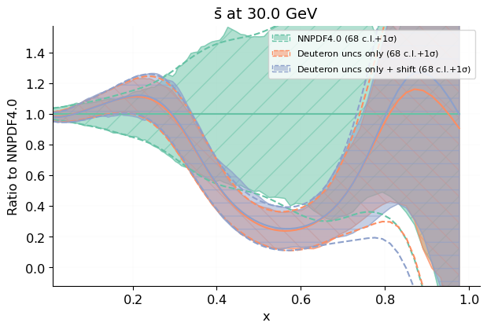 [.pdf](figures/pdfscalespecs0_basespecs0_pdfnormalize0_plot_pdfs_bars.pdf) [#](#pdfscalespecs0_basespecs0_pdfnormalize0_plot_pdfs_bars)](figures/pdfscalespecs0_basespecs0_pdfnormalize0_plot_pdfs_bars.png){#pdfscalespecs0_basespecs0_pdfnormalize0_plot_pdfs_bars} 

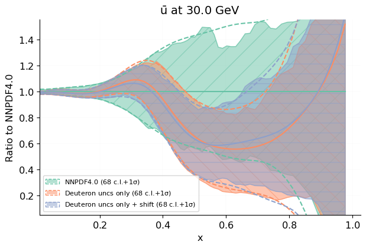 [.pdf](figures/pdfscalespecs0_basespecs0_pdfnormalize0_plot_pdfs_baru.pdf) [#](#pdfscalespecs0_basespecs0_pdfnormalize0_plot_pdfs_baru)](figures/pdfscalespecs0_basespecs0_pdfnormalize0_plot_pdfs_baru.png){#pdfscalespecs0_basespecs0_pdfnormalize0_plot_pdfs_baru} 

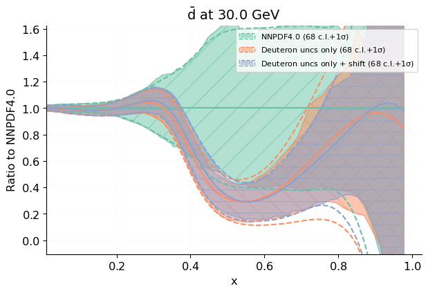 [.pdf](figures/pdfscalespecs0_basespecs0_pdfnormalize0_plot_pdfs_bard.pdf) [#](#pdfscalespecs0_basespecs0_pdfnormalize0_plot_pdfs_bard)](figures/pdfscalespecs0_basespecs0_pdfnormalize0_plot_pdfs_bard.png){#pdfscalespecs0_basespecs0_pdfnormalize0_plot_pdfs_bard} 

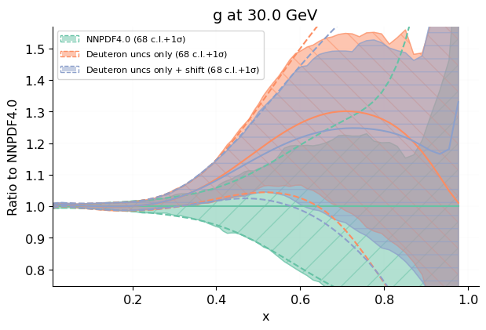 [.pdf](figures/pdfscalespecs0_basespecs0_pdfnormalize0_plot_pdfs_g.pdf) [#](#pdfscalespecs0_basespecs0_pdfnormalize0_plot_pdfs_g)](figures/pdfscalespecs0_basespecs0_pdfnormalize0_plot_pdfs_g.png){#pdfscalespecs0_basespecs0_pdfnormalize0_plot_pdfs_g} 

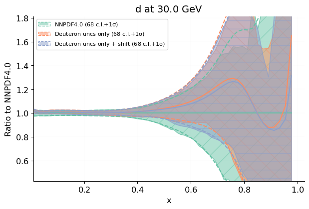 [.pdf](figures/pdfscalespecs0_basespecs0_pdfnormalize0_plot_pdfs_d.pdf) [#](#pdfscalespecs0_basespecs0_pdfnormalize0_plot_pdfs_d)](figures/pdfscalespecs0_basespecs0_pdfnormalize0_plot_pdfs_d.png){#pdfscalespecs0_basespecs0_pdfnormalize0_plot_pdfs_d} 

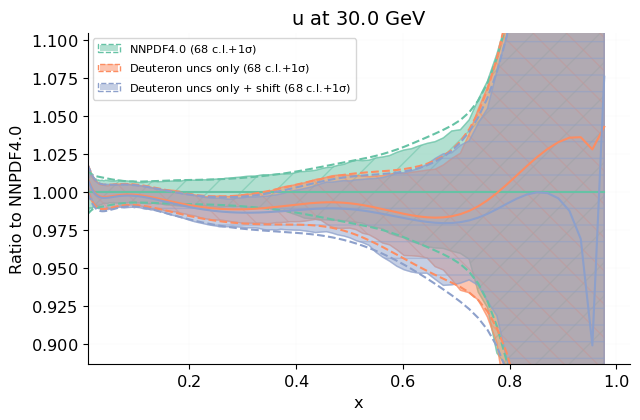 [.pdf](figures/pdfscalespecs0_basespecs0_pdfnormalize0_plot_pdfs_u.pdf) [#](#pdfscalespecs0_basespecs0_pdfnormalize0_plot_pdfs_u)](figures/pdfscalespecs0_basespecs0_pdfnormalize0_plot_pdfs_u.png){#pdfscalespecs0_basespecs0_pdfnormalize0_plot_pdfs_u} 

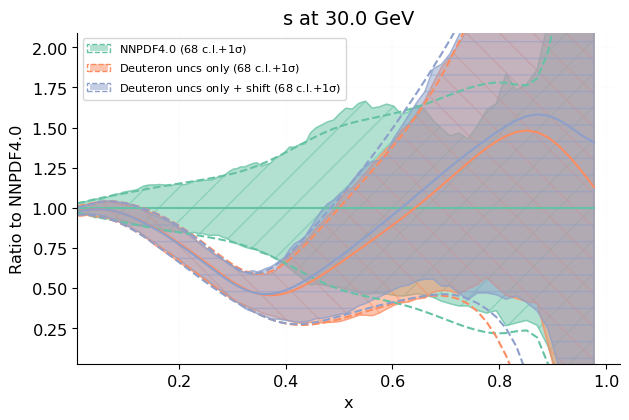 [.pdf](figures/pdfscalespecs0_basespecs0_pdfnormalize0_plot_pdfs_s.pdf) [#](#pdfscalespecs0_basespecs0_pdfnormalize0_plot_pdfs_s)](figures/pdfscalespecs0_basespecs0_pdfnormalize0_plot_pdfs_s.png){#pdfscalespecs0_basespecs0_pdfnormalize0_plot_pdfs_s} 

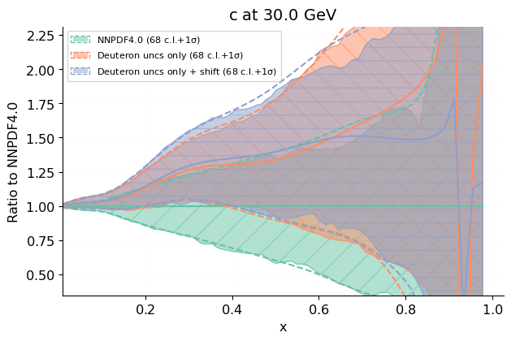 [.pdf](figures/pdfscalespecs0_basespecs0_pdfnormalize0_plot_pdfs_c.pdf) [#](#pdfscalespecs0_basespecs0_pdfnormalize0_plot_pdfs_c)](figures/pdfscalespecs0_basespecs0_pdfnormalize0_plot_pdfs_c.png){#pdfscalespecs0_basespecs0_pdfnormalize0_plot_pdfs_c} 

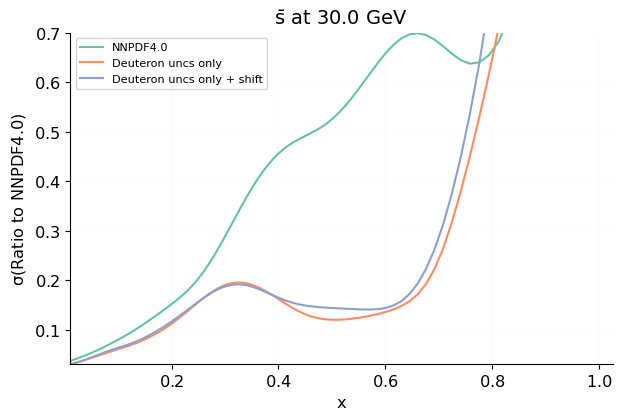 [.pdf](figures/pdfscalespecs0_basespecs0_pdfnormalize0_plot_pdf_uncertainties_bars.pdf) [#](#pdfscalespecs0_basespecs0_pdfnormalize0_plot_pdf_uncertainties_bars)](figures/pdfscalespecs0_basespecs0_pdfnormalize0_plot_pdf_uncertainties_bars.png){#pdfscalespecs0_basespecs0_pdfnormalize0_plot_pdf_uncertainties_bars} 

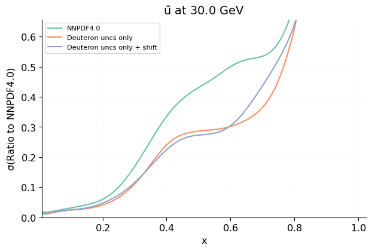 [.pdf](figures/pdfscalespecs0_basespecs0_pdfnormalize0_plot_pdf_uncertainties_baru.pdf) [#](#pdfscalespecs0_basespecs0_pdfnormalize0_plot_pdf_uncertainties_baru)](figures/pdfscalespecs0_basespecs0_pdfnormalize0_plot_pdf_uncertainties_baru.png){#pdfscalespecs0_basespecs0_pdfnormalize0_plot_pdf_uncertainties_baru} 

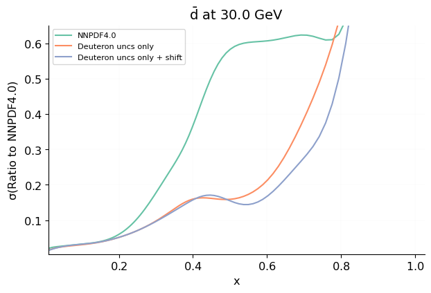 [.pdf](figures/pdfscalespecs0_basespecs0_pdfnormalize0_plot_pdf_uncertainties_bard.pdf) [#](#pdfscalespecs0_basespecs0_pdfnormalize0_plot_pdf_uncertainties_bard)](figures/pdfscalespecs0_basespecs0_pdfnormalize0_plot_pdf_uncertainties_bard.png){#pdfscalespecs0_basespecs0_pdfnormalize0_plot_pdf_uncertainties_bard} 

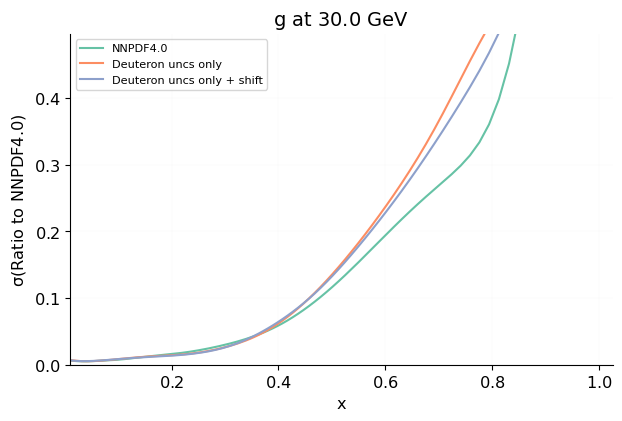 [.pdf](figures/pdfscalespecs0_basespecs0_pdfnormalize0_plot_pdf_uncertainties_g.pdf) [#](#pdfscalespecs0_basespecs0_pdfnormalize0_plot_pdf_uncertainties_g)](figures/pdfscalespecs0_basespecs0_pdfnormalize0_plot_pdf_uncertainties_g.png){#pdfscalespecs0_basespecs0_pdfnormalize0_plot_pdf_uncertainties_g} 

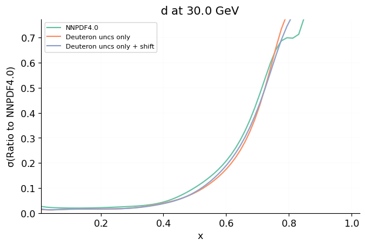 [.pdf](figures/pdfscalespecs0_basespecs0_pdfnormalize0_plot_pdf_uncertainties_d.pdf) [#](#pdfscalespecs0_basespecs0_pdfnormalize0_plot_pdf_uncertainties_d)](figures/pdfscalespecs0_basespecs0_pdfnormalize0_plot_pdf_uncertainties_d.png){#pdfscalespecs0_basespecs0_pdfnormalize0_plot_pdf_uncertainties_d} 

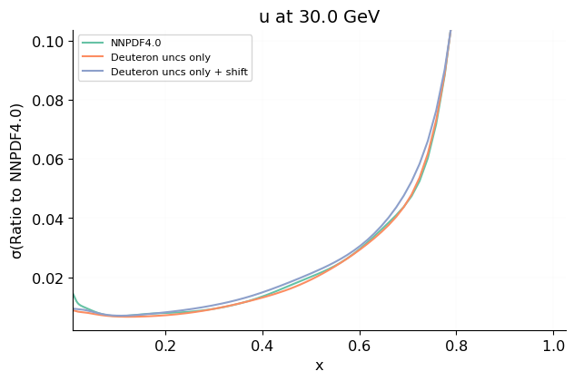 [.pdf](figures/pdfscalespecs0_basespecs0_pdfnormalize0_plot_pdf_uncertainties_u.pdf) [#](#pdfscalespecs0_basespecs0_pdfnormalize0_plot_pdf_uncertainties_u)](figures/pdfscalespecs0_basespecs0_pdfnormalize0_plot_pdf_uncertainties_u.png){#pdfscalespecs0_basespecs0_pdfnormalize0_plot_pdf_uncertainties_u} 

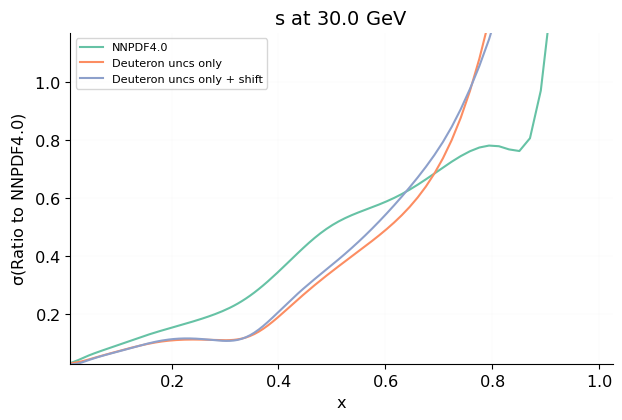 [.pdf](figures/pdfscalespecs0_basespecs0_pdfnormalize0_plot_pdf_uncertainties_s.pdf) [#](#pdfscalespecs0_basespecs0_pdfnormalize0_plot_pdf_uncertainties_s)](figures/pdfscalespecs0_basespecs0_pdfnormalize0_plot_pdf_uncertainties_s.png){#pdfscalespecs0_basespecs0_pdfnormalize0_plot_pdf_uncertainties_s} 

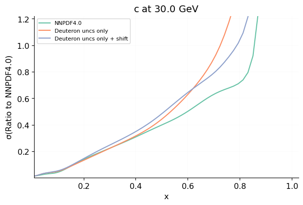 [.pdf](figures/pdfscalespecs0_basespecs0_pdfnormalize0_plot_pdf_uncertainties_c.pdf) [#](#pdfscalespecs0_basespecs0_pdfnormalize0_plot_pdf_uncertainties_c)](figures/pdfscalespecs0_basespecs0_pdfnormalize0_plot_pdf_uncertainties_c.png){#pdfscalespecs0_basespecs0_pdfnormalize0_plot_pdf_uncertainties_c} 

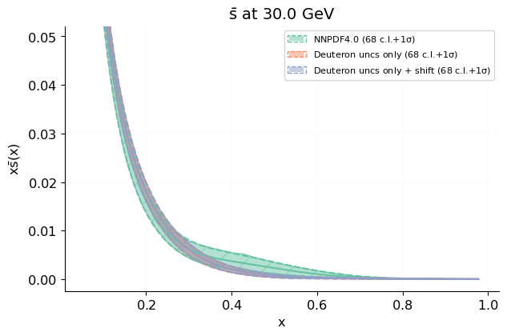 [.pdf](figures/pdfscalespecs0_basespecs0_plot_pdfs_bars.pdf) [#](#pdfscalespecs0_basespecs0_plot_pdfs_bars)](figures/pdfscalespecs0_basespecs0_plot_pdfs_bars.png){#pdfscalespecs0_basespecs0_plot_pdfs_bars} 

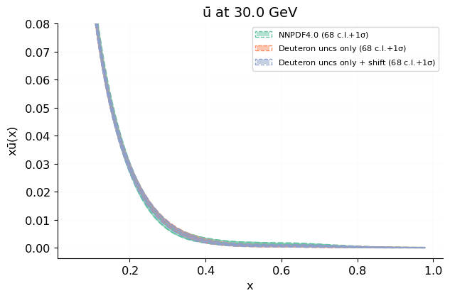 [.pdf](figures/pdfscalespecs0_basespecs0_plot_pdfs_baru.pdf) [#](#pdfscalespecs0_basespecs0_plot_pdfs_baru)](figures/pdfscalespecs0_basespecs0_plot_pdfs_baru.png){#pdfscalespecs0_basespecs0_plot_pdfs_baru} 

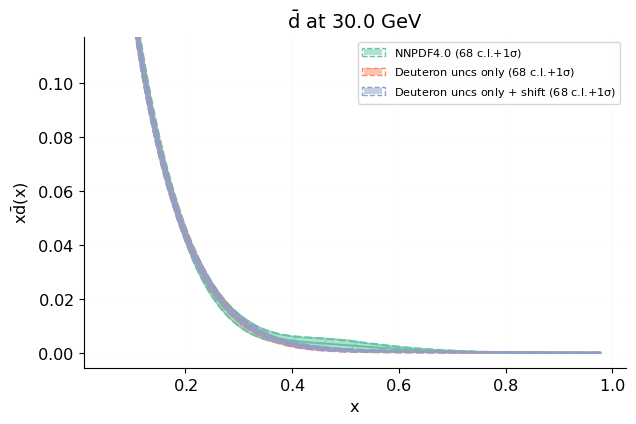 [.pdf](figures/pdfscalespecs0_basespecs0_plot_pdfs_bard.pdf) [#](#pdfscalespecs0_basespecs0_plot_pdfs_bard)](figures/pdfscalespecs0_basespecs0_plot_pdfs_bard.png){#pdfscalespecs0_basespecs0_plot_pdfs_bard} 

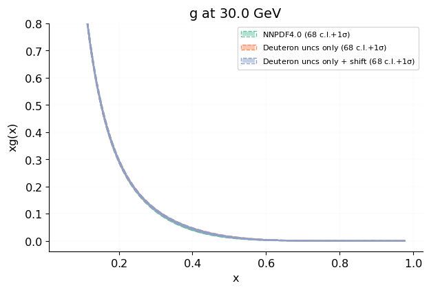 [.pdf](figures/pdfscalespecs0_basespecs0_plot_pdfs_g.pdf) [#](#pdfscalespecs0_basespecs0_plot_pdfs_g)](figures/pdfscalespecs0_basespecs0_plot_pdfs_g.png){#pdfscalespecs0_basespecs0_plot_pdfs_g} 

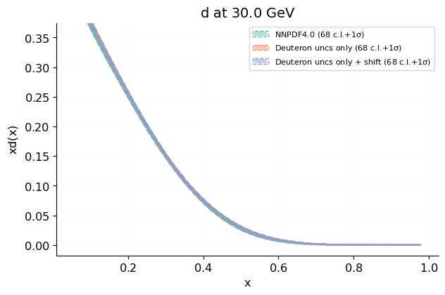 [.pdf](figures/pdfscalespecs0_basespecs0_plot_pdfs_d.pdf) [#](#pdfscalespecs0_basespecs0_plot_pdfs_d)](figures/pdfscalespecs0_basespecs0_plot_pdfs_d.png){#pdfscalespecs0_basespecs0_plot_pdfs_d} 

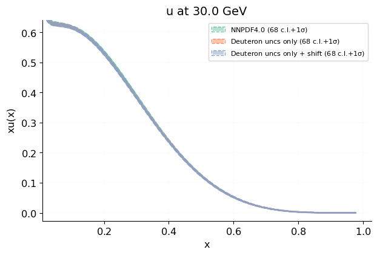 [.pdf](figures/pdfscalespecs0_basespecs0_plot_pdfs_u.pdf) [#](#pdfscalespecs0_basespecs0_plot_pdfs_u)](figures/pdfscalespecs0_basespecs0_plot_pdfs_u.png){#pdfscalespecs0_basespecs0_plot_pdfs_u} 

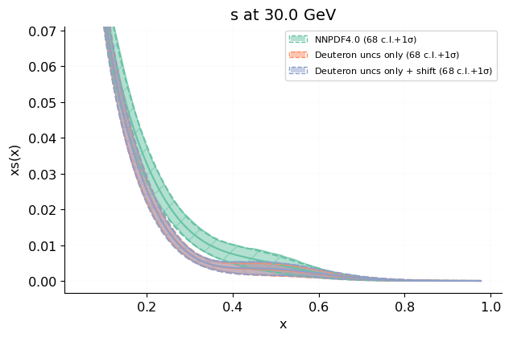 [.pdf](figures/pdfscalespecs0_basespecs0_plot_pdfs_s.pdf) [#](#pdfscalespecs0_basespecs0_plot_pdfs_s)](figures/pdfscalespecs0_basespecs0_plot_pdfs_s.png){#pdfscalespecs0_basespecs0_plot_pdfs_s} 

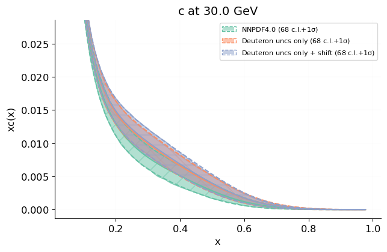 [.pdf](figures/pdfscalespecs0_basespecs0_plot_pdfs_c.pdf) [#](#pdfscalespecs0_basespecs0_plot_pdfs_c)](figures/pdfscalespecs0_basespecs0_plot_pdfs_c.png){#pdfscalespecs0_basespecs0_plot_pdfs_c} 

